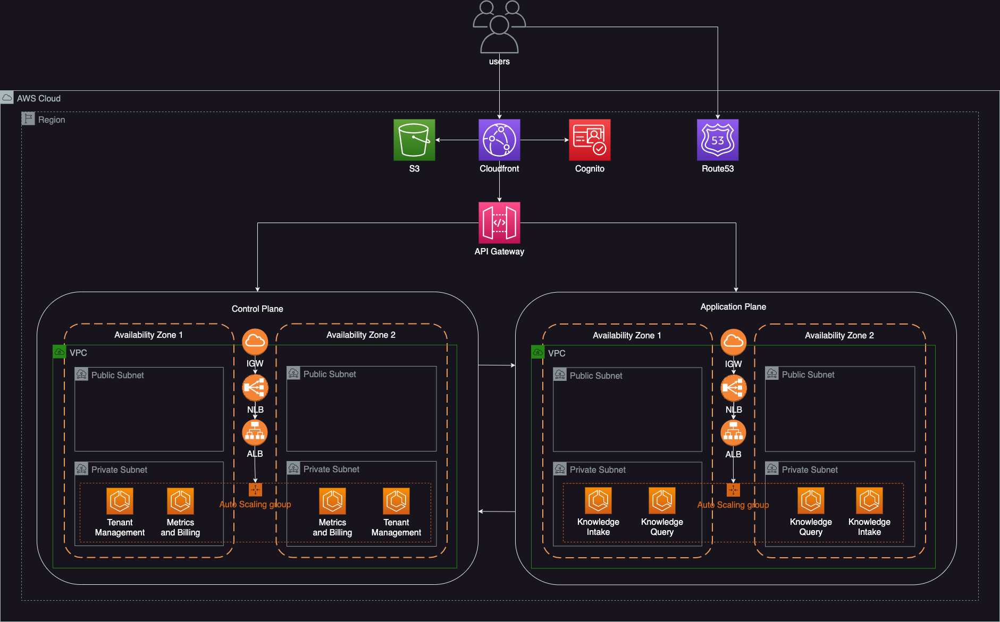

# kb-infra

## Overview

The `kb-infra` repository provides the base infrastructure for building a SaaS microservice application. It includes Terraform configurations and CI/CD pipelines to deploy and manage the necessary infrastructure components.

## Architecture

The architecture of the SaaS microservice application includes the following components:

- **VPC**: A Virtual Private Cloud to host the infrastructure.
- **ECR**: An Elastic Container Registry to store Docker images.
- **ECS**: Elastic Container Service to run Docker containers.
- **Lambda**: AWS Lambda authorizers for API Gateway.
- **API Gateway**: API Gateway to route requests to the microservices.
- **SSM**: AWS Systems Manager Parameter Store to manage configuration parameters.

The infrastructure is defined using Terraform and deployed using a CI/CD pipeline configured with GitHub Actions. The app name is used to retrieve configuration details from AWS SSM.

## Related Repositories

- **[kb-control-plane](https://github.com/Franco-Technologies/kb-control-plane)**: Manages the deployment of VPC, load balancer, and API Gateway integration for control plane microservices to be deployed into.
- **[kb-tenant-service](https://github.com/Franco-Technologies/kb-tenant-service)**: A sample control plane microservice for managing tenants deployed in the designated VPC defined by `kb-control-plane`.

## Infrastructure

This repository includes the following infrastructure components:

- **ECR**: Manages the Elastic Container Registry for storing Docker images.
- **ECS**: Deploys the microservices as ECS tasks and services.
- **Lambda**: Configures AWS Lambda authorizers for API Gateway.
- **API Gateway**: Sets up API Gateway for routing requests to the microservices.
- **SSM**: Stores configuration parameters in AWS Systems Manager Parameter Store.

## CI/CD Pipeline

The project includes a CI/CD pipeline configured using GitHub Actions. The pipeline is defined in the `.github/workflows/terraform.yml` file and is triggered on pushes and pull requests to the `main` and `dev` branches.

### Dependencies

- **Terraform**: The pipeline requires Terraform to be installed and configured.
- **AWS CLI**: The AWS CLI must be configured with appropriate credentials.
- **GitHub Secrets**: The following secrets must be set in the GitHub repository:
  - `AWS_ACCESS_KEY_ID`
  - `AWS_SECRET_ACCESS_KEY`
  - `PAT` (Personal Access Token for GitHub)

### Pipeline Steps

1. **Initialize Terraform**:

   - The pipeline initializes the Terraform configuration.

2. **Plan Deployment**:

   - The pipeline plans the Terraform deployment to preview the changes.

3. **Apply Configuration**:
   - The pipeline applies the Terraform configuration to provision the infrastructure.
